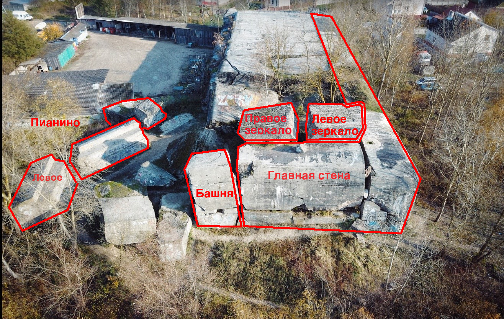

***********************************
Guidebook - Волынка / Powder cellar
***********************************

Описание
########

Как добраться:
**************

* с Центра: автобус - 1, 1А, 20; маршрутка - 1;
* c Южного: автобус - 1А, 20; маршрутка - 1;
* c Востока (остановка на Короне): маршрутка - 1;

Выходить на остановке - ФОРТ.

Координаты - 52°03'39.0"N 23°41'20.2"E

Общественный транспорт
***********************

* Автобусы: 1, 1А, 20

С Газоаппарата, остановки «Волынка» или «Форт»

* Маршрутное такси №1

(ОАО «Агротранс» - Центральная городская больница) - остановка «Форт»

07.30-18.00 интервал движения 10-15 мин.,
18.00-20.00 интервал движения 15-20 мин.

Остановки:

ОАО «Брестский мясокомбинат» - ОАО «Агротранс» - ул.Смирнова - ул.Речицкая -
ул.Адамковская - ул.Южная - ул.Веселая - ул.Брестских дивизий - ул.Ленина -
ул.Мицкевича - ул.Комсомольская - пр-т Машерова.

В обратном направлении:

ул.Ленина - пр-т Машерова - б-р Шевченко - ул.Махновича - ул.Мытная -
ул.Грибоедова - Варшавское шоссе - Женский монастырь - ул.Ковельская -
ул.Свято-Афанасьевская - ул.Кирпичная - Ковельское шоссе - ул.Жукова -
ул. Защитников Отечества - ул.Гвардейская - ул.Рокосовского - ул.Жукова -
ул.Суворова - ул.Волгоградская - ул.Луцкая - ул.28 Июля - ул.Московская -
ул.Советской Конституции - ул.Ленинградская - ул.Гродненская -
ул.Лактионова - Центральная городская больница.

Сектор - Башня и Камин
#######################

.. image:: img/1.png

.. image:: img/5.png

.. image:: img/6.png

.. image:: img/7.png

+---+-------------------+-------------------+-----------+--------+---------+------------+
| # | Название маршрута | Название маршрута | Категория | Высота | Оттяжки | Примечания |
|   | в старом гайде    |                   |           |        |         |            |
| 1 |                   | ?                 | 5a        |        |   -     | Top rope   |
+---+-------------------+-------------------+-----------+--------+---------+------------+
| 2 | Камин             | Камин             | 4-5a      |        |   -     |            |
+---+-------------------+-------------------+-----------+--------+---------+------------+
| 3 | Башня по стене    |                   | 5b-5c     | 6м     |   3     | *ДЗ ОРГАН* |
|   | в Камине          |                   |           |        |         |            |
+---+-------------------+-------------------+-----------+--------+---------+------------+
| 4 |                   |                   |           |        |   3?    | *HARDCORE* |
+---+-------------------+-------------------+-----------+--------+---------+------------+
| 5 | 13. Башня по углу |                   | 5b-5c     | 5м     |   3     |            |
|   | с пробки          |                   |           |        |         |            |
+---+-------------------+-------------------+-----------+--------+---------+------------+
| 6 | *12*              |                   | 7a-7b     | 5м     |         | Top rope   |
+---+-------------------+-------------------+-----------+--------+---------+------------+
| 7 |  Трещина у Камина | ?                 | 5a        |        |   -     | Top rope   |
+---+---------------------+-------------------+-----------+--------+---------+----------+

Старое описание
*********************** 

В левой части торца от основного массива сквозным Камином отделена Башня.
Ширина Камина 30-60см. Высота Башни с внутренней стороны и Камина - 5м,
с внешней (торца Волынки) - 7м.

**Траверс** начинается от внутренней(к ценру Волынки) стены Башни и идет вокруг
нее до внешнего вертикального стыка(внешнего края Камина).(5а, 8-10м)

**Трещина у Камина** это внешний край Камина, часто используется для подъема на
соревнованиях по ТПМ(5а,7м).

**Камин** обычно лезут по ценральной части(4-5а,5м)

**Башня по стене в Камине** это каминная стена Башни ближе к центру Волынки(5b-5c,6м)

**13. Башня по углу с пробки** внешний левый угол башни(5b-5c,5м)

**12** (7а-7b,5м) 

Главная стена
##############

.. image:: img/8.png

Старое описание
****************

Высота - около 8 метров. Известна своими вертикальными "трещинами" -
любимыми всеми посетителями Волынки. Используется также для тренировки
спуска "дюльфером". На всех маршрутах возможно лазание с ПТС(закладками,
чаще - больших размеров, реже - крючьями), имеются также стационарные
анкера. ГС содержит маршруты примущественно альпинистского типа.
Перечень маршрутов справа налево.
                        
**Стык** - стык блоков Волынки, без разрушений - находится в крайней правой,
неразрушенной части стены (5с, возможно лазание с ПТС)

**Правая трещина** также проходит по стыку блоков(в 5м левее пред.маршрута)
но узкая и имеет отколы (5с, возможно лазание с ПТС)                

**Откол** идет от середины правой трещины налево вверх(6с, возможно лазание с ПТС)

**Трещина** другие названия - *мужская*, *главная* - наверно самый 
популярный маршрут на Волынке, включается практически во все соревнования.
Возможно начинать маршрут немного правее - что немного усложняет его(5b)
и прибавляет пикантности(5а, возможно лазание с ПТС).

**Женская трещина** находится за поворотом в торце, тоже стык блоков с отколами.
Тоже есть два варианта начала: первый(основной) - с угла Волынки налево к стыку,
второй - прямо вверх с камня. (5а,4-5м,возможно лазание с ПТС).

**Траверс** обычно начинается с камня Женской трещины направо, далее за поворот
вверх к середине Мужской трещины и далее к Правой трещине. Для удлинения и 
усложнения маршрут можно начать за Башней, у Камина, и продолжить после 
Правой трещины далее направо - закидыванием петель на трубы торчащие из стен
Волынки. Можно разнообразить технику траверсом на головках ледорубов. Маршрут
хорошо прорабатывает руки и требует "шахтерских" навыков, на нем обычно
отрабатывается работа со сменой связок.(5а-5b, возможно лазание с ПТС) 

+---+-------------------+-------------------+-----------+--------+---------+------------+
| # | Название маршрута | Название маршрута | Категория | Высота | Оттяжки | Примечания |
|   | в старом гайде    |                   |           |        |         |            |
+---+-------------------+-------------------+-----------+--------+---------+------------+
| 8 |                   |                   |           |        |         |            |
+---+-------------------+-------------------+-----------+--------+---------+------------+
| 9 | Женская           |                   |           |        |         |            |
+---+-------------------+-------------------+-----------+--------+---------+------------+
| 10| Траверс           |                   |  5a-5b    |        |         |            |
+---+-------------------+-------------------+-----------+--------+---------+------------+
|11 | Мужская           |   Мужская         | 5a (5b)   |        |         |            |
+---+-------------------+-------------------+-----------+--------+---------+------------+
| 12|                   |  Зигзаг           |           |        |         |            |
+---+-------------------+-------------------+-----------+--------+---------+------------+
|13 | Откол             |                   | 6с        |        |         |            |
+---+-------------------+-------------------+-----------+--------+---------+------------+
|14 | Правая трещина    |                   |           |        |         |            |
+---+-------------------+-------------------+-----------+--------+---------+------------+
|15 | Стык              |  Гвоздь           | 5с        |        |  3      |            |
+---+-------------------+-------------------+-----------+--------+---------+------------+
|                                          ИТОшные трассы ?                             |
+---+-------------------+-------------------+-----------+--------+---------+------------+
|   |                   |                   |           |        |         |            |
+---+-------------------+-------------------+-----------+--------+---------+------------+

Зеркала
##########

Старое описание
****************

Внутри Волынки бывший ее потолок при взрыве поднялся на дыбы и образовались
два Зеркала - Правое(ПЗ,ближе к Башне) и Левое(ЛЗ). Содержат маршруты
скалолазного типа. (Зеркала частично видны на фотке на этой странице)

**Правый кант Правого Зеркала**. Нависает над площадкой у Камина.(6b-6с, 6м,75гр)

**Кант**. Левый кант Правого зеркала. Часто используется для тренировок и
соревнований.(5а-5b,5м,75гр)

**Правое зеркало**. Маршрут по мизерам в центре ПЗ.(6b-6с,6м,75гр)

**Левое зеркало**. Маршрут по мизерам в центре ЛЗ.(6a,5м,75гр)

**Левый кант**. Левого Зеркала.(5а,4м,75гр)

**Торец Левого Зеркала** (5а; 3,5м)

**Камин Зеркал Зазеркалье** (5с,7м)

**ПЗ из камина по центру** (6b,7м)

**ПЗ из камина ближе к Канту** Не используя кант(6а, 6м)

+---+-------------------+-------------------+-----------+--------+---------+------------+
| # | Название маршрута | Название маршрута | Категория | Высота | Оттяжки | Примечания |
|   | в старом гайде    |                   |           |        |         |            |
+---+-------------------+-------------------+-----------+--------+---------+------------+
|   |                   |                   |           |        |         |            |
+---+-------------------+-------------------+-----------+--------+---------+------------+

Пианино
########

Старое описание
****************

В наиболее разрушенной части Волынки(ближе к дороге на 5 Форт)
лежат три отколотых куска, изнутри напоминающие пианино.
Если смотреть изнутри то слева будет Левое Пианино(ЛП),
а справа - Правое, а в центре понятно какое. Высота - 3-4 метра.

**ЛП по правому торцу** Можно залесть 4 вариантами.
1 - ближний - часть Олимпийки, состоит из 2-3 движений(5b,3м),
2 -рядом с 1 - легче(5а,3м),3- по центру(6b,4м),
4 - дальний, пронумерован как 11(5с,4м)

**Фасад ЛП** тут можно лазить как угодно...

**Карниз ЦП** ближний угол левого торца(6а,3м)

**Траверс левого торца ЦП** (5а-5b,5м)

**Шестерка** левый торец Правого Пианино, в декабре 2004 года кусок ПП
отвалился и этот маршрут изменился. Из старых остался только правый его
вариант - наиболее трудный(6с,6м,возможно лазание с ПТС)

**Карниз** и лазят же! Центр фасада Правого Пианино(6с-7а,6м,
возможно лазание с ПТС)

**ПП Справа** правый торец Правого Пианина(3-4)

+---+-------------------+-------------------+-----------+--------+---------+------------+
| # | Название маршрута | Название маршрута | Категория | Высота | Оттяжки | Примечания |
|   | в старом гайде    |                   |           |        |         |            |
+---+-------------------+-------------------+-----------+--------+---------+------------+
|   |                   |                   |           |        |         |            |
+---+-------------------+-------------------+-----------+--------+---------+------------+

Пирамида
#########

Старое описание
*****************

Внизу в центре разрушенной части Волынки лежит большой наклонный кусок
треугольной формы - Пирамида. (Вообще-то он никак не называется)
Маршруты даны если смотреть от нижнего острого карниза.

**Ребро** левее карниза наверх по ребу(3-4,7м)

**Карниз** или прямо с навеса или справа по камешкам на ребро(5)

**Левая стена**. Мизера(6а-6c,5м)

**Правый склон**. Камешки(5а-5с)

**Трение** - задняя грань(5, 3-4м)

+---+-------------------+-------------------+-----------+--------+---------+------------+
| # | Название маршрута | Название маршрута | Категория | Высота | Оттяжки | Примечания |
|   | в старом гайде    |                   |           |        |         |            |
+---+-------------------+-------------------+-----------+--------+---------+------------+
|   |                   |                   |           |        |         |            |
+---+-------------------+-------------------+-----------+--------+---------+------------+

Сортир
#######

Старое описание
******************

Правее правого пианино находится Сортир. Это собственно говоря ниша, которая
раньше была внутренним помещением. Еще в конце 80-х годов в ней можно
было стоять в полный рост. Сейчас можно влезть разве что на четвереньках.
Кстати многие участки Волынки в начале 90-х годов были засыпаны песком.
Допустим весь торец Волынки был выше - так что стоя поднятая рука была
на уровне горизонтального стыка. А сейчас в центре стык на уровне колен.
Можно было бы организоваться и "откопать" засыпанную Волынку - от чего она
стала бы красивее и нам было бы интереснее. Прохождение Сортира можно
продолжить выходом на верх Волынки по трещине стены стыка, либо траверсом
по стене стыка вправо.

**Сортир** Над нишей - стенка. Начало либо снизу(как через карниз),
либо справа(хитрый участок)(5а-5b,4-5м)

**Трещина** Левее пред.маршрута есть трещина - по ней вверх(4-5а)

**Зеркало** Левее трещины можно еще пролезть..(5b)

+---+-------------------+-------------------+-----------+--------+---------+------------+
| # | Название маршрута | Название маршрута | Категория | Высота | Оттяжки | Примечания |
|   | в старом гайде    |                   |           |        |         |            |
+---+-------------------+-------------------+-----------+--------+---------+------------+
|   |                   |                   |           |        |         |            |
+---+-------------------+-------------------+-----------+--------+---------+------------+

Разминка
#########

Для разминки используется трасса "Олимпийка" - сочетание некоторых
упомянутых маршрутов и других коротких участков свободным лазанием.
Начинается она с выхода по правому торцу Правого Пианино в его
верхний центр, далее траверс вдоль ПП налево, спуск недоходя до
карниза, 1 подъем на ЛП, траверс влево,спуск,трение по малой пирамиде,
правое ребро Пирамиды, спуск сзади, траверс Башни, подъем по карнизу,
левое зеркало по торцу, спрыгивание на малый камень с удержанием
равновесия(опасно- поэтому чаще просто спрыгивают), траверс ЛЗ по
мизерам, спуск с плиты в сторону внутрь, подъем по углу шестерки ПП
и спуск с нее справа.

Также существует и "сложная" Олимпийка: подъем по мизерам на правый
торец ЦЗ,спуск тутже за углом, карниз, спуск за углом,траверс,11,
спуск, пирамида справа через карниз и далее по склону,спуск,
траверс башни,подъем по стыку,траверс от камня между зеркалами,
кант ПЗ, спуск,подъем через карниз на ЛЗ,спуск по торцу ЛЗ,
траверс ЛЗ по мизерам,далее - также как и в простом варианте (до
раскола ПЗ - подъем на ПЗ по центру).
